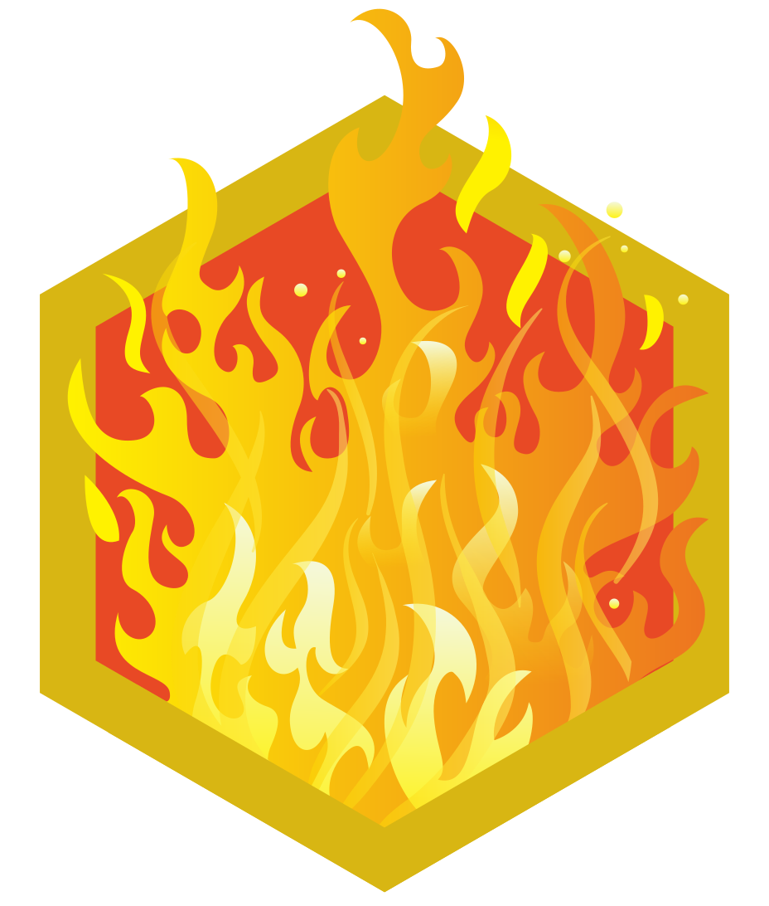

# TryHackMe-Workspace

## Rooms

| **Finished** | **Type**    | **Level** | **Room Name**                                                                            |
| ------------ | ----------- | --------- | ---------------------------------------------------------------------------------------- |
| 2025-06-10   | Walkthrough | Easy      | [Web Application Basics](https://tryhackme.com/room/webapplicationbasics)                |
| 2025-05-03   | Walkthrough | Easy      | [Moniker Link (CVE-2024-21413)](https://tryhackme.com/room/monikerlink)                  |
| 2025-05-03   | Walkthrough | Easy      | [John the Ripper: The Basics](https://tryhackme.com/room/johntheripperbasics)            |
| 2025-04-28   | Walkthrough | Easy      | [Hashing Basics](https://tryhackme.com/room/hashingbasics)                               |
| 2025-04-25   | Walkthrough | Easy      | [Public Key Cryptography Basics](https://tryhackme.com/room/publickeycrypto)             |
| 2025-04-23   | Walkthrough | Easy      | [Cryptography Basics](https://tryhackme.com/room/cryptographybasics)                     |
| 2025-04-21   | Walkthrough | Easy      | [Nmap: The Basics](https://tryhackme.com/room/nmap)                                      |
| 2025-04-20   | Walkthrough | Easy      | [Windows PowerShell](https://tryhackme.com/room/windowspowershell)                       |
| 2025-04-15   | Walkthrough | Easy      | [Tcpdump: The Basics](https://tryhackme.com/room/tcpdump)                                |
| 2025-04-14   | Walkthrough | Easy      | [Wireshark: The Basics](https://tryhackme.com/room/wiresharkthebasics)                   |
| 2025-04-12   | Walkthrough | Easy      | [Networking Secure Protocols](https://tryhackme.com/room/networkingsecureprotocols)      |
| 2025-04-10   | Walkthrough | Easy      | [Networking Core Protocols](https://tryhackme.com/room/networkingcoreprotocols)          |
| 2025-04-04   | Walkthrough | Easy      | [Networking Essentials](https://tryhackme.com/room/networkingessentials)                 |
| 2025-03-15   | Walkthrough | Easy      | [Networking Concepts](https://tryhackme.com/room/networkingconcepts)                     |
| 2025-03-15   | Walkthrough | Easy      | [Linux Shells](https://tryhackme.com/room/linuxshells)                                   |
| 2025-03-14   | Walkthrough | Easy      | [Windows Command Line](https://tryhackme.com/room/windowscommandline)                    |
| 2025-03-12   | Walkthrough | Easy      | [Introductory Networking](https://tryhackme.com/room/introtonetworking)                  |
| 2025-02-20   | Walkthrough | Easy      | [Active Directory Basics](https://tryhackme.com/room/winadbasics)                        |
| 2025-02-03   | Walkthrough | Easy      | [Junior Security Analyst Intro](https://tryhackme.com/room/jrsecanalystintrouxo)         |
| 2025-01-27   | Walkthrough | Easy      | [Putting it all together](https://tryhackme.com/room/puttingitalltogether)               |
| 2025-01-26   | Walkthrough | Easy      | [How Websites Work](https://tryhackme.com/room/howwebsiteswork)                          |
| 2025-01-26   | Walkthrough | Easy      | [HTTP in Detail](https://tryhackme.com/room/httpindetail)                                |
| 2025-01-26   | Walkthrough | Easy      | [DNS in detail](https://tryhackme.com/room/dnsindetail)                                  |
| 2025-01-24   | Walkthrough | Info      | [Extending Your Network](https://tryhackme.com/room/extendingyournetwork)                |
| 2025-01-22   | Walkthrough | Easy      | [Advent of Cyber 2024](https://tryhackme.com/room/adventofcyber2024)                     |
| 2025-01-22   | Walkthrough | Info      | [Packets & Frames](https://tryhackme.com/room/packetsframes)                             |
| 2025-01-22   | Walkthrough | Info      | [OSI Model](https://tryhackme.com/room/osimodelzi)                                       |
| 2025-01-22   | Walkthrough | Info      | [Intro to LAN](https://tryhackme.com/room/introtolan)                                    |
| 2025-01-22   | Walkthrough | Info      | [What is Networking?](https://tryhackme.com/room/whatisnetworking)                       |
| 2025-01-20   | Walkthrough | Info      | [Careers in Cyber](https://tryhackme.com/room/careersincyber)                            |
| 2024-12-02   | Walkthrough | Easy      | [Offensive Security Intro](https://tryhackme.com/room/offensivesecurityintro)            |
| 2024-12-01   | Walkthrough | Easy      | [Introductory Researching](https://tryhackme.com/room/introtoresearch)                   |
| 2024-10-28   | Walkthrough | Info      | [Windows Fundamentals 3](https://tryhackme.com/room/windowsfundamentals3xzx)             |
| 2024-10-28   | Walkthrough | Info      | [Windows Fundamentals 2](https://tryhackme.com/room/windowsfundamentals2x0x)             |
| 2024-10-27   | Walkthrough | Info      | [Windows Fundamentals 1](https://tryhackme.com/room/windowsfundamentals1xbx)             |
| 2024-10-24   | Walkthrough | Easy      | [Search Skills](https://tryhackme.com/room/searchskills)                                 |
| 2024-10-22   | Walkthrough | Easy      | [Defensive Security Intro](https://tryhackme.com/room/defensivesecurityintro)            |
| 2023-01-25   | Walkthrough | Easy      | [Starting Out In Cyber Sec](https://tryhackme.com/room/startingoutincybersec)            |
| 2021-01-18   | Walkthrough | Easy      | [Nmap](https://tryhackme.com/room/furthernmap)                                           |
| 2021-11-17   | Walkthrough | Info      | [Learn the Linux Fundamentals Part 3](https://tryhackme.com/room/linuxfundamentalspart3) |
| 2021-11-16   | Walkthrough | Info      | [Learn the Linux Fundamentals Part 2](https://tryhackme.com/room/linuxfundamentalspart2) |
| 2021-11-14   | Walkthrough | Info      | [Learn the Linux Fundamentals Part 1](https://tryhackme.com/room/linuxfundamentalspart1) |
| 2021-11-14   | Walkthrough | Easy      | [Toolbox: Vim](https://tryhackme.com/room/toolboxvim)                                    |
| 2021-11-14   | Walkthrough | Easy      | [Python for Pentesters](https://tryhackme.com/room/pythonforcybersecurity)               |
| 2021-11-12   | Walkthrough | Easy      | [Python Basics](https://tryhackme.com/room/pythonbasics)                                 |

## Certificates

| **Date**   | **Type**    | **Level** | **Certificate Name**                                                 |
| ---------- | ----------- | --------- | -------------------------------------------------------------------- |
| 2025-04-08 | CTF         | Medium    | [Hackfinity Battle](https://tryhackme.com/room/HackfinityBattle)     |
| 2025-01-27 | Walkthrough | Easy      | [Pre Security](https://tryhackme.com/path/outline/presecurity)       |
| 2025-01-22 | Walkthrough | Easy      | [Advent of Cyber 2024](https://tryhackme.com/room/adventofcyber2024) |

## Badges

| **Badge**                                                                                  | **Date**   | **Name**             |
| ------------------------------------------------------------------------------------------ | ---------- | -------------------- |
|             | 2025-05-30 | 180 Day Streak       |
|               | 2025-02-28 | 90 Day Streak        |
|        | 2025-01-27 | World Wide Web       |
|                        | 2025-01-26 | Webbed               |
|  | 2025-01-24 | Networking Nerd      |
|             | 2025-01-22 | Advent of Cyber 2024 |
|               | 2024-12-30 | 30 Day Streak        |
|                 | 2021-12-11 | 7 Day Streak         |
|                  | 2021-11-17 | cat linux.txt        |

180 Day Streak

## Summaries

| **Date**   | **Room Name**                                                         |
| ---------- | --------------------------------------------------------------------- |
| 2025-04-10 | [Networking Core Protocols](./summaries/Networking_Core_Protocols.md) |
