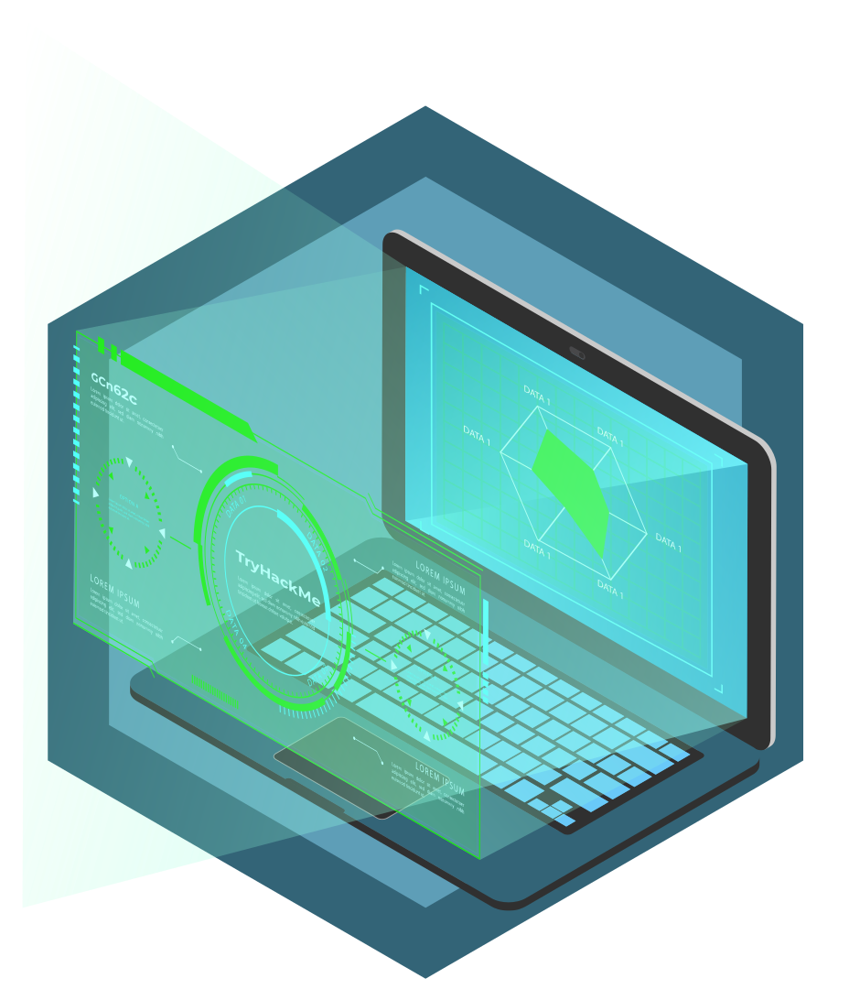

# TryHackMe-Workspace

## Rooms

| **Finished** |  **Type**   | **Level** | **Room Name**                                                                                |
| :----------: | :---------: | :-------: | :------------------------------------------------------------------------------------------- |
|  2026-01-19  | Walkthrough |   EASY    | [OWASP Top 10 2025: Insecure Data Handling](https://tryhackme.com/room/owasptopten2025three) |
|  2026-01-19  | Walkthrough |   EASY    | [OWASP Top 10 2025: Application Design Flaws](https://tryhackme.com/room/owasptopten2025two) |
|  2026-01-18  | Walkthrough |   EASY    | [OWASP Top 10 2025: IAAA Failures](https://tryhackme.com/room/owasptopten2025one)            |
|  2026-01-18  | Walkthrough |   EASY    | [Training Impact on Teams](https://tryhackme.com/room/training)                              |
|  2026-01-18  | Walkthrough |   EASY    | [Security Principles](https://tryhackme.com/room/securityprinciples)                         |
|  2026-01-18  | Walkthrough |   EASY    | [FlareVM: Arsenal of Tools](https://tryhackme.com/room/flarevmarsenaloftools)                |
|  2026-01-18  | Walkthrough |   EASY    | [Systems as Attack Vectors](https://tryhackme.com/room/systemsattackvectors)                 |
|  2026-01-18  | Walkthrough |   EASY    | [Humans as Attack Vectors](https://tryhackme.com/room/humansattackvectors)                   |
|  2026-01-18  | Walkthrough |   EASY    | [SOC Role in Blue Team](https://tryhackme.com/room/socroleinblueteam)                        |
|  2026-01-18  | Walkthrough |   EASY    | [REMnux: Getting Started](https://tryhackme.com/room/remnuxgettingstarted)                   |
|  2026-01-17  | Walkthrough |   EASY    | [CAPA: The Basics](https://tryhackme.com/room/capabasics)                                    |
|  2026-01-11  | Walkthrough |   Easy    | [CyberChef: The Basics](https://tryhackme.com/room/cyberchefbasics)                          |
|  2026-01-11  | Walkthrough |   Easy    | [Vulnerability Scanner Overview](https://tryhackme.com/room/vulnerabilityscanneroverview)    |
|  2026-01-10  | Walkthrough |   Easy    | [IDS Fundamentals](https://tryhackme.com/room/idsfundamentals)                               |
|  2026-01-10  | Walkthrough |   Easy    | [Firewall Fundamentals](https://tryhackme.com/room/firewallfundamentals)                     |
|  2026-01-09  | Walkthrough |   Easy    | [Introduction to SIEM](https://tryhackme.com/room/introtosiem)                               |
|  2026-01-09  | Walkthrough |   Easy    | [Logs Fundamentals](https://tryhackme.com/room/logsfundamentals)                             |
|  2026-01-09  | Walkthrough |   Easy    | [Incident Response Fundamentals](https://tryhackme.com/room/incidentresponsefundamentals)    |
|  2026-01-03  | Walkthrough |   Easy    | [Digital Forensics Fundamentals](https://tryhackme.com/room/digitalforensicsfundamentals)    |
|  2026-01-02  | Walkthrough |   Easy    | [SOC Fundamentals](https://tryhackme.com/room/socfundamentals)                               |
|  2026-01-01  | Walkthrough |   Easy    | [SQLMap: The Basics](https://tryhackme.com/room/sqlmapthebasics)                             |
|  2026-01-01  | Walkthrough |   Easy    | [Shells Overview](https://tryhackme.com/room/shellsoverview)                                 |
|  2025-12-28  | Walkthrough |   Easy    | [Gobuster: The Basics](https://tryhackme.com/room/gobusterthebasics)                         |
|  2025-12-24  | Walkthrough |   Easy    | [Advent of Cyber 2025](https://tryhackme.com/adventofcyber25)                                |
|  2025-12-01  | Walkthrough |   Easy    | [Burp Suite: The Basics](https://tryhackme.com/room/burpsuitebasics)                         |
|  2025-11-23  | Walkthrough |   Easy    | [SQL Fundamentals](https://tryhackme.com/room/sqlfundamentals)                               |
|  2025-11-23  | Walkthrough |   Easy    | [JavaScript Essentials](https://tryhackme.com/room/javascriptessentials)                     |
|  2025-11-23  | Walkthrough |   Easy    | [Blue](https://tryhackme.com/room/blue)                                                      |
|  2025-11-22  | Walkthrough |   Easy    | [Metasploit: Meterpreter](https://tryhackme.com/room/meterpreter)                            |
|  2025-11-21  | Walkthrough |   Easy    | [Advent of Cyber Prep Track](https://tryhackme.com/room/adventofcyberpreptrack)              |
|  2025-11-21  | Walkthrough |   Easy    | [Metasploit: Exploitation](https://tryhackme.com/room/metasploitexploitation)                |
|  2025-06-12  | Walkthrough |   Easy    | [Metasploit: Introduction](https://tryhackme.com/room/metasploitintro)                       |
|  2025-06-10  | Walkthrough |   Easy    | [Web Application Basics](https://tryhackme.com/room/webapplicationbasics)                    |
|  2025-05-03  | Walkthrough |   Easy    | [Moniker Link (CVE-2024-21413)](https://tryhackme.com/room/monikerlink)                      |
|  2025-05-03  | Walkthrough |   Easy    | [John the Ripper: The Basics](https://tryhackme.com/room/johntheripperbasics)                |
|  2025-04-28  | Walkthrough |   Easy    | [Hashing Basics](https://tryhackme.com/room/hashingbasics)                                   |
|  2025-04-25  | Walkthrough |   Easy    | [Public Key Cryptography Basics](https://tryhackme.com/room/publickeycrypto)                 |
|  2025-04-23  | Walkthrough |   Easy    | [Cryptography Basics](https://tryhackme.com/room/cryptographybasics)                         |
|  2025-04-21  | Walkthrough |   Easy    | [Nmap: The Basics](https://tryhackme.com/room/nmap)                                          |
|  2025-04-20  | Walkthrough |   Easy    | [Windows PowerShell](https://tryhackme.com/room/windowspowershell)                           |
|  2025-04-15  | Walkthrough |   Easy    | [Tcpdump: The Basics](https://tryhackme.com/room/tcpdump)                                    |
|  2025-04-14  | Walkthrough |   Easy    | [Wireshark: The Basics](https://tryhackme.com/room/wiresharkthebasics)                       |
|  2025-04-12  | Walkthrough |   Easy    | [Networking Secure Protocols](https://tryhackme.com/room/networkingsecureprotocols)          |
|  2025-04-10  | Walkthrough |   Easy    | [Networking Core Protocols](https://tryhackme.com/room/networkingcoreprotocols)              |
|  2025-04-04  | Walkthrough |   Easy    | [Networking Essentials](https://tryhackme.com/room/networkingessentials)                     |
|  2025-03-15  | Walkthrough |   Easy    | [Networking Concepts](https://tryhackme.com/room/networkingconcepts)                         |
|  2025-03-15  | Walkthrough |   Easy    | [Linux Shells](https://tryhackme.com/room/linuxshells)                                       |
|  2025-03-14  | Walkthrough |   Easy    | [Windows Command Line](https://tryhackme.com/room/windowscommandline)                        |
|  2025-03-12  | Walkthrough |   Easy    | [Introductory Networking](https://tryhackme.com/room/introtonetworking)                      |
|  2025-02-20  | Walkthrough |   Easy    | [Active Directory Basics](https://tryhackme.com/room/winadbasics)                            |
|  2025-02-03  | Walkthrough |   Easy    | [Junior Security Analyst Intro](https://tryhackme.com/room/jrsecanalystintrouxo)             |
|  2025-01-27  | Walkthrough |   Easy    | [Putting it all together](https://tryhackme.com/room/puttingitalltogether)                   |
|  2025-01-26  | Walkthrough |   Easy    | [How Websites Work](https://tryhackme.com/room/howwebsiteswork)                              |
|  2025-01-26  | Walkthrough |   Easy    | [HTTP in Detail](https://tryhackme.com/room/httpindetail)                                    |
|  2025-01-26  | Walkthrough |   Easy    | [DNS in detail](https://tryhackme.com/room/dnsindetail)                                      |
|  2025-01-24  | Walkthrough |   Info    | [Extending Your Network](https://tryhackme.com/room/extendingyournetwork)                    |
|  2025-01-22  | Walkthrough |   Easy    | [Advent of Cyber 2024](https://tryhackme.com/room/adventofcyber2024)                         |
|  2025-01-22  | Walkthrough |   Info    | [Packets & Frames](https://tryhackme.com/room/packetsframes)                                 |
|  2025-01-22  | Walkthrough |   Info    | [OSI Model](https://tryhackme.com/room/osimodelzi)                                           |
|  2025-01-22  | Walkthrough |   Info    | [Intro to LAN](https://tryhackme.com/room/introtolan)                                        |
|  2025-01-22  | Walkthrough |   Info    | [What is Networking?](https://tryhackme.com/room/whatisnetworking)                           |
|  2025-01-20  | Walkthrough |   Info    | [Careers in Cyber](https://tryhackme.com/room/careersincyber)                                |
|  2024-12-02  | Walkthrough |   Easy    | [Offensive Security Intro](https://tryhackme.com/room/offensivesecurityintro)                |
|  2024-12-01  | Walkthrough |   Easy    | [Introductory Researching](https://tryhackme.com/room/introtoresearch)                       |
|  2024-10-28  | Walkthrough |   Info    | [Windows Fundamentals 3](https://tryhackme.com/room/windowsfundamentals3xzx)                 |
|  2024-10-28  | Walkthrough |   Info    | [Windows Fundamentals 2](https://tryhackme.com/room/windowsfundamentals2x0x)                 |
|  2024-10-27  | Walkthrough |   Info    | [Windows Fundamentals 1](https://tryhackme.com/room/windowsfundamentals1xbx)                 |
|  2024-10-24  | Walkthrough |   Easy    | [Search Skills](https://tryhackme.com/room/searchskills)                                     |
|  2024-10-22  | Walkthrough |   Easy    | [Defensive Security Intro](https://tryhackme.com/room/defensivesecurityintro)                |
|  2023-01-25  | Walkthrough |   Easy    | [Starting Out In Cyber Sec](https://tryhackme.com/room/startingoutincybersec)                |
|  2021-01-18  | Walkthrough |   Easy    | [Nmap](https://tryhackme.com/room/furthernmap)                                               |
|  2021-11-17  | Walkthrough |   Info    | [Learn the Linux Fundamentals Part 3](https://tryhackme.com/room/linuxfundamentalspart3)     |
|  2021-11-16  | Walkthrough |   Info    | [Learn the Linux Fundamentals Part 2](https://tryhackme.com/room/linuxfundamentalspart2)     |
|  2021-11-14  | Walkthrough |   Info    | [Learn the Linux Fundamentals Part 1](https://tryhackme.com/room/linuxfundamentalspart1)     |
|  2021-11-14  | Walkthrough |   Easy    | [Toolbox: Vim](https://tryhackme.com/room/toolboxvim)                                        |
|  2021-11-14  | Walkthrough |   Easy    | [Python for Pentesters](https://tryhackme.com/room/pythonforcybersecurity)                   |
|  2021-11-12  | Walkthrough |   Easy    | [Python Basics](https://tryhackme.com/room/pythonbasics)                                     |

## Certificates

|  **Date**  |  **Type**   | **Level** | **Certificate Name**                                                      |
| :--------: | :---------: | :-------: | :------------------------------------------------------------------------ |
| 2026-01-19 | Walkthrough |   Easy    | [Cyber Security 101](https://tryhackme.com/path/outline/cybersecurity101) |
| 2025-12-24 | Walkthrough |   Easy    | [Advent of Cyber 2025](https://tryhackme.com/adventofcyber25)             |
| 2025-04-08 |     CTF     |  Medium   | [Hackfinity Battle](https://tryhackme.com/room/HackfinityBattle)          |
| 2025-01-27 | Walkthrough |   Easy    | [Pre Security](https://tryhackme.com/path/outline/presecurity)            |
| 2025-01-22 | Walkthrough |   Easy    | [Advent of Cyber 2024](https://tryhackme.com/room/adventofcyber2024)      |

## Badges

|                                           **Badge**                                            |  **Date**  | **Name**             |
| :--------------------------------------------------------------------------------------------: | :--------: | :------------------- |
|                  | 2025-01-19 | OWASP Top 10         |
|                  | 2025-01-18 | Cyber Ready          |
|       | 2025-01-18 | Shield Apprentice    |
|  | 2025-01-18 | First Step into SOC  |
|               | 2025-01-17 | Advent of Cyber 2025 |
|         | 2026-01-02 | Sword Apprentice     |
|                                | 2025-11-23 | Blue                 |
|                | 2025-11-22 | Metasploitable       |
|                     | 2025-11-21 | 3 Day Streak         |
|                 | 2025-05-30 | 180 Day Streak       |
|                   | 2025-02-28 | 90 Day Streak        |
|            | 2025-01-27 | World Wide Web       |
|                            | 2025-01-26 | Webbed               |
|      | 2025-01-24 | Networking Nerd      |
|               | 2025-01-22 | Advent of Cyber 2024 |
|                   | 2024-12-30 | 30 Day Streak        |
|                     | 2021-12-11 | 7 Day Streak         |
|                      | 2021-11-17 | cat linux.txt        |

## Summaries

|  **Date**  | **Update** | **Room Name**                                                                   |
| :--------: | :--------: | :------------------------------------------------------------------------------ |
| 2026-01-17 |     -      | [CAPA: The Basics](./summaries/CAPA-The-Basics.md)                              |
| 2026-01-11 |     -      | [CyberChef: The Basics](./summaries/CyberChef-The-Basics.md)                    |
| 2026-01-11 |     -      | [Vulnerability Scanner Overview](./summaries/Vulnerability-Scanner-Overview.md) |
| 2026-01-10 |     -      | [IDS Fundamentals](./summaries/IDS-Fundamentals.md)                             |
| 2026-01-10 |     -      | [Firewall Fundamentals](./summaries/Firewall-Fundamentals.md)                   |
| 2026-01-09 |     -      | [Introduction to SIEM](./summaries/Introduction-to-SIEM.md)                     |
| 2026-01-09 |     -      | [Logs Fundamentals](./summaries/Logs-Fundamentals.md)                           |
| 2026-01-09 |     -      | [Incident Response Fundamentals](./summaries/Incident-Response-Fundamentals.md) |
| 2026-01-03 |     -      | [Digital Forensics Fundamentals](./summaries/Digital-Forensics-Fundamentals.md) |
| 2026-01-02 |     -      | [SOC Fundamentals](./summaries/SOC-Fundamentals.md)                             |
| 2026-01-02 |     -      | [SQL Injection(SQLMap)](./summaries/SQL_Map.md)                                 |
| 2026-01-01 | 2026-01-02 | [Shells Overview](./summaries/Shells.md)                                        |
| 2025-12-28 | 2026-01-02 | [SQL : Fundamentals](./summaries/SQL-Fundamentals.md)                           |
| 2025-11-23 | 2025-12-29 | [Metasploit: Meter Exploit](./summaries/Metasploit-Meter-Exploit.md)            |
| 2025-11-22 | 2026-01-02 | [Metasploit: Meterpreter](./summaries/Metasploit-Meterpreter.md)                |
| 2025-11-21 | 2025-12-29 | [Metasploit: Exploitation](./summaries/Metasploit-Exploitation.md)              |
| 2025-04-12 | 2026-01-02 | [Networking: Secure Protools](./summaries/Networking-Secure-Protools.md)        |
| 2025-04-12 | 2026-01-02 | [Networking: Concepts](./summaries/Networking-Concepts.md)                      |
| 2025-04-10 | 2026-01-02 | [Networking: Core Protocols](./summaries/Networking-Core-Protocols.md)          |
